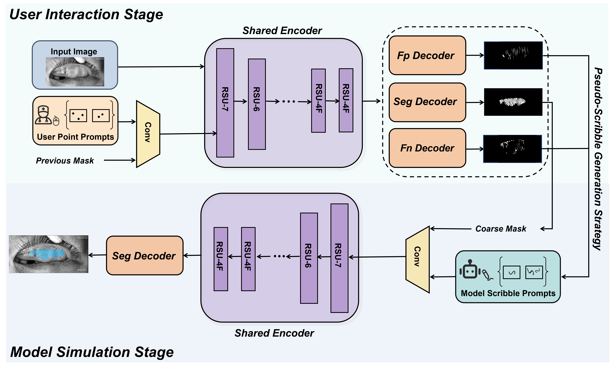
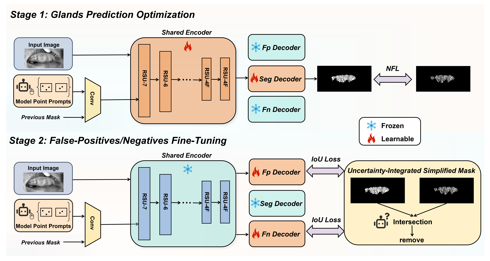
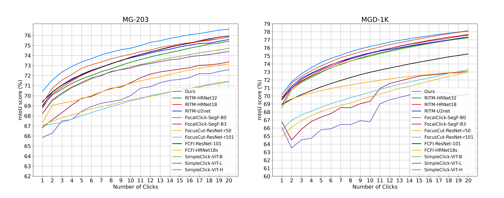

# PseudoScribble
## PseudoScribble: Interactive Meibomian Gland Segmentation with Scribble Simulation

## Introduction

<p align="center">
  
  
</p>

**In this study, we aim to develop an innovative interactive segmentation framework (PseudoScribble) for infrared meibography images. This is the first application of interactive segmentation technology in the field of infrared meibography images. We first parallelly introduce two error prediction decoders with the existing powerful segmentation backbone to predict false positive and false negative regions of the backbone's output. Considering that the false positive regions are mainly located at the gland edges due to the blurry gland boundaries, we introduce edge generation modules in the false positive decoder to more effectively capture the edge information. Inspired by the previous iterative sampling strategy, we design a pseudo-scribble generation strategy based on the two predicted error regions, allowing the model to automatically perform scribbling within the error regions, which approximates human interactive actions. By our approach, the model is capable of providing users with additional, helpful scribbles without requiring any effort from them.**
 
 
 **Our proposed model achieves state-of-the-art performance on both our internal private dataset and the public dataset.**

## Environment
Training and evaluation environment: Python3.9.4, PyTorch 2.3.1, CUDA 12.4. Run the following command to install required packages.
```
pip3 install -r requirements.txt
```
## Data
We train and evaluate all our models on our internal private dataset MG-203 and the public dataset MGD-1K. The [MGD-1K](https://mgd1k.github.io/) dataset can be accessed online.

We assume the data folder (`datasets`) has the following structure:

```
datasets
├── <dataset_name> 
│ └── img
│   └── ...
│ └── label
│   └── ...
│ └── train
│   └── train.txt
│ └── val
│   └── val.txt
│ └── test
│   └── test.txt
│ └── metrics
```

## Training

### Pretrained models
Before training, please download the [U<sup>2</sup>-Net](https://github.com/xuebinqin/U-2-Net) pretrained weights (click to download: [u2net.pth](https://drive.google.com/file/d/1ao1ovG1Qtx4b7EoskHXmi2E9rp5CHLcZ/view?pli=1), [u2netp.pth](https://drive.google.com/file/d/1rbSTGKAE-MTxBYHd-51l2hMOQPT_7EPy/view)) and configure the dowloaded path in [config.yml](config.yml).

### training script
We provide the scripts for training our models on the MGD-1K dataset. You can start training with the following commands:
```
python3 train.py models/iter_mask/u2net_mgd1k_itermask_edge_pseudoscribble.py
--gpus=0
--exp-name=pseudo_scribble_mgd1k
--workers=4
```

### Main training function
There are multiple input parameters in the `train.py` file, but most of them have default values.

Input of `train.py`:
```
# These are used to limit the number of clicks during the training of the interactive model.
--num-max-points        # the maximum number of sampled clicks
----max-num-next-clicks      # the maximum number of iteratively sampled clicks each batch

# These are used to set the parameters for the proposed UISM strategy.
--fp-gamma    # upper bound of the model’s uncertain region area     
--fn-gamma    # lower bound of the model’s uncertain region area
--remove-samll-object-area   # remove small target regions from the fp mask or fn mask
--next-stage-strat   # the starting epoch for the second stage of training
```

## Evaluation

We provide the `test.py` file to evaluate the performance of the proposed model, along with code for testing the model's utility in the `script` folder.
The command to test the model is as follows:
```
python3 test.py
```
Note: You need to adjust the parameter configuration area of the `test.py` code according to the comments.

## Demo

We are developing an infrared meibomian gland image annotation and analysis system. It will incorporate the trained PseudoScribble and allow users to iteratively interact for precise annotation. Additionally, it will calculate various morphological parameters of the annotations to objectively assess the severity of meibomian gland dysfunction (MGD). The code will be released later.

